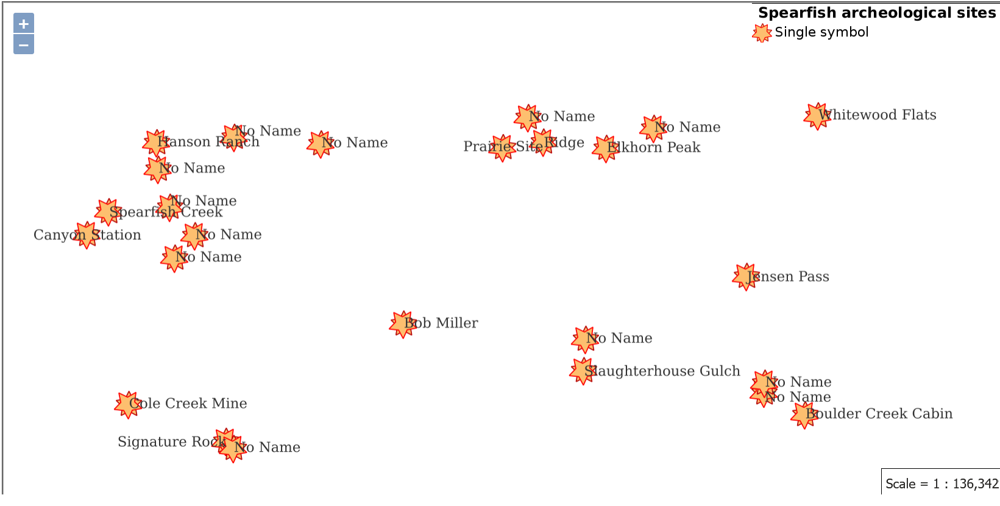
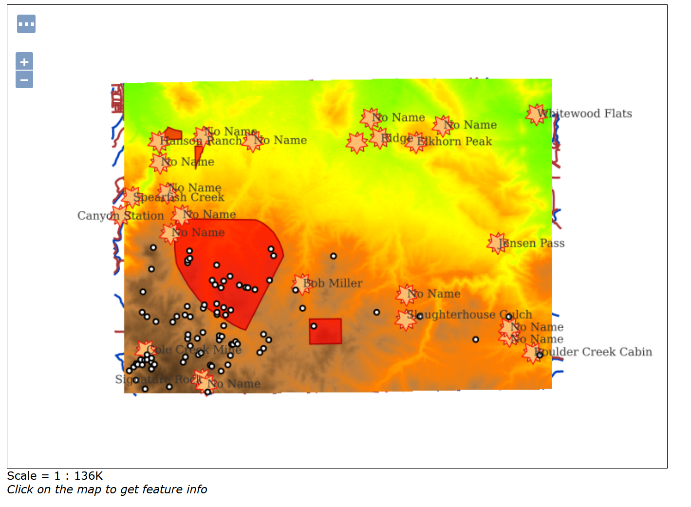

**Q1: What is the URL of the WMS GetCapabilities request?**
- https://supreme-waddle-xr4579gqg5p26j66-8080.app.github.dev/geoserver/ows?service=WMS&version=1.3.0&request=GetCapabilities

**Q2: What is the URL of the WFS GetCapabilities request?**
- https://supreme-waddle-xr4579gqg5p26j66-8080.app.github.dev/geoserver/ows?service=WFS&acceptversions=2.0.0&request=GetCapabilities

**Q3: Submit a screenshot of your updated WFS Layer Preview**
- 

**Q4: What does drawing order refer to? Which layer goes on top, the first or the last layer in the list?**
- The drawing order refer to the layers and the layers that goes on top is the last layer in the list which in this case is the bug sites.

**Q5: Submit a screenshot of the Layer Preview of the Spearfish Layer Group when sf:sfdem is listed as the 3rd layer.**
- 

**Q6: What is the WMS url for the single-tiled request?**
- https://supreme-waddle-xr4579gqg5p26j66-8080.app.github.dev/geoserver/wms?SERVICE=WMS&VERSION=1.1.1&REQUEST=GetMap&FORMAT=image%2Fpng&TRANSPARENT=true&STYLES&LAYERS=spearfish&exceptions=application%2Fvnd.ogc.se_inimage&SRS=EPSG%3A26713&WIDTH=1900&HEIGHT=1000&BBOX=593188.974847707%2C4922433.722149498%2C597722.0247071157%2C4924819.38717055

**Q7: What is the WMS url for one of the tiled requests? What is the image size?**
- Image size is 256 (width) x 256 (height)
- https://supreme-waddle-xr4579gqg5p26j66-8080.app.github.dev/geoserver/wms?SERVICE=WMS&VERSION=1.1.1&REQUEST=GetMap&FORMAT=image%2Fpng&TRANSPARENT=true&tiled=true&STYLES&LAYERS=spearfish&exceptions=application%2Fvnd.ogc.se_inimage&tilesOrigin=589425.9342365642%2C4913959.224611808&WIDTH=256&HEIGHT=256&SRS=EPSG%3A26713&BBOX=599817.0769824311%2C4919477.329955688%2C601038.7003571407%2C4920698.953330398

**Q8: What is the URL of your coarse resolution sample of a WMTS url? What level does this tile refer to? Notice the differences. What are some of the fields that are unique to this url?**
- https://supreme-waddle-xr4579gqg5p26j66-8080.app.github.dev/geoserver/gwc/service/wmts?layer=spearfish&style=&tilematrixset=EPSG%3A4326&Service=WMTS&Request=GetTile&Version=1.0.0&Format=image%2Fpng&TileMatrix=EPSG%3A4326%3A14&TileCol=6936&TileRow=4142
- The zoom level refers to zoom level of 14.
- Some of the fields that unique is tilematrix, tilecol, and tilerow.

**Q9: In the zoomed-out URL, what are the TileCol and TileRow?**
- Tile column 1733 and tile row 1036

**Q10: In the zoomed-in URL, what are the TileCol and TileRow?**
- https://supreme-waddle-xr4579gqg5p26j66-8080.app.github.dev/geoserver/gwc/service/wmts?layer=spearfish&style=&tilematrixset=EPSG%3A4326&Service=WMTS&Request=GetTile&Version=1.0.0&Format=image%2Fpng&TileMatrix=EPSG%3A4326%3A21&TileCol=888076&TileRow=530348
- Tile column 888076 and tile row 530348

**Q11: Why are they so different for the same location in the map?**
- Because the tiles are representing different zoomed layers of the same location

**Q12: Is there a difference in the TileMatrix? %3A is an HTML encoding for a colon, :.What does the number after EPSG:4326 mean?**
- Yes, previously the number in the zoomed out link was 14 but the specific TileMatrix in this zoomed link is 21. EPSG:4326:21 refers to the specific zoom level of the tile being requested. The number after EPSG:4326 indicates the zoom level. Higher numbers correspond to more zoomed-in views.